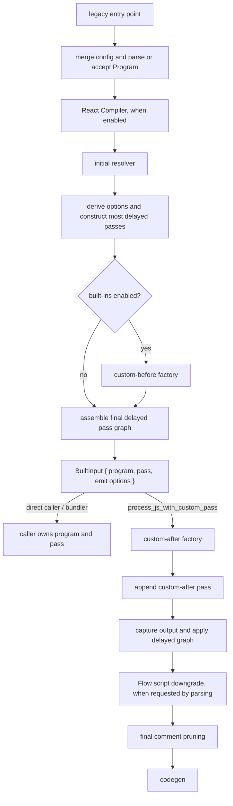

# Frozen pass-building pipeline

This directory preserves `Options::build_as_input`, `BuiltInput`,
`BuiltInput::with_pass`, and `ModuleConfig::build`. The legacy delayed-input
and custom-pass adapters remain in `../../legacy.rs`; primary compilation uses
the direct pipeline.



With both custom passes, execution keeps the legacy order:

```text
plugin-before? → lint → early syntax transforms → TypeScript/Flow stripping
→ plugin-after? → custom-before → React/optimizer → compatibility/module
→ AST minifier → hygiene/fixer → Jest/dropped-comment preservation → custom-after
```

- Both custom factories observe `BuiltInput.program` before the delayed graph
  runs. "Before" and "after" describe where their returned passes execute.
- With built-ins disabled, `BuiltInput::pass` contains no built-in transforms
  and custom-before is skipped. The custom-pass adapter still schedules
  custom-after after the remaining pass.
- The frozen pre-parsed `Program` adapters do not repeat Flow script/module
  classification. Source input is classified while parsing; a direct
  `build_as_input` caller indicates whether a stripped Flow type-only module
  must become a script.
- Direct `BuiltInput` consumers own the pass execution environment, metadata,
  and emit. The `process_js_with_custom_pass` adapter owns those responsibilities
  for legacy custom-pass callers.

Treat pass order, factory timing, defaults, comments, source maps, and Flow
behavior as compatibility-sensitive. Keep this path compatibility-only; new
compilation behavior belongs in the direct pipeline.
