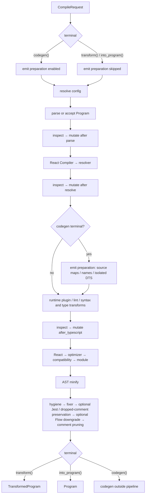

# Direct compilation pipeline

`Compiler::compile` creates a lazy `CompileRequest`; a terminal executes this
pipeline without using `Options::build_as_input`.

- Hooks run only at a terminal and always inspect before mutating.
- Input source-map loading, name collection, and isolated-DTS generation are
  codegen-only stages after resolver hooks and before runtime plugins and
  built-in transforms.
- The `after_typescript` boundary is also reached for JavaScript and Flow. It
  follows early syntax transforms and the runtime-plugin checkpoint.
- Runtime plugins have one checkpoint: before lint with `runPluginFirst`,
  otherwise after syntax/type transforms.
- AST and codegen minification are independent. `CompileInput::program`
  preserves the supplied Module/Script variant, while resolved options still
  select later transforms. Its spans and comments must refer to the supplied
  `SourceFile`, which must be registered in the compiler's source map.
- `transform()` retains comments and helper requirements; `into_program()`
  returns only the final AST.

The frozen delayed-pass path is documented in `../config/legacy/README.md`.
