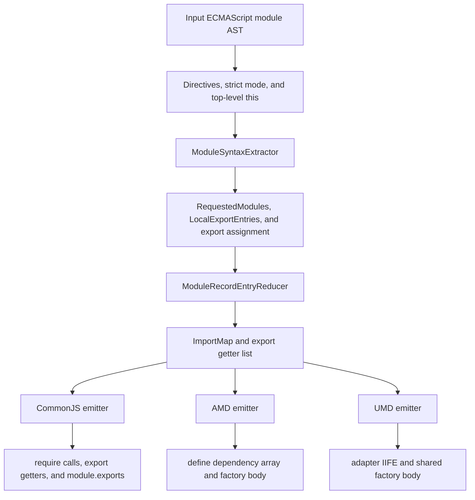
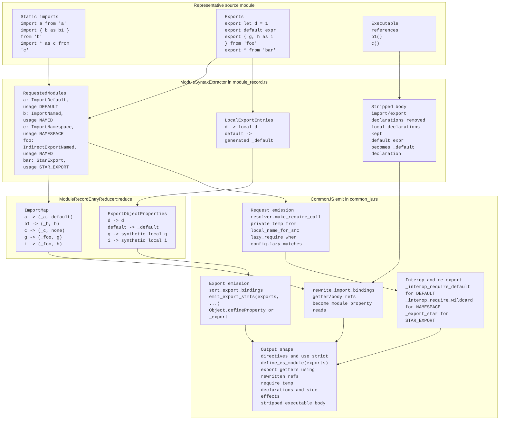

# CommonJS, AMD, and UMD Module Transforms

This crate lowers ECMAScript module syntax into several legacy module formats.
The CommonJS, AMD, and UMD passes share the same source-module collection model
and then diverge only at the format-specific import/export emit boundary.



SystemJS is implemented in the same crate, but it does not use the flow
described here.

## Shared Terminology

The shared extractor in `src/module_record.rs` intentionally uses names close to
the ECMAScript module record vocabulary:

- `ModuleSyntaxExtractor` walks source module declarations, records their module
  linkage information, and removes module declarations from the executable body.
- `RequestedModules` is grouped by module request string and preserves source
  order with `IndexMap`.
- `RequestedModule` stores the first useful source span, the collected
  `ModuleRecordEntry` set for that request, and `ModuleRequestUsage`.
- `LocalExportEntries` stores local exports keyed by exported name.
- `ModuleRecordEntry` represents import entries, indirect export entries,
  star exports, and TypeScript `import = require(...)` entries.
- `ModuleRecordEntryReducer` converts collected entries into emitter-facing
  structures: an `ImportMap` for rewritten local references and an
  `ExportObjectProperties` list for generated export getters.

The model is not a full ECMAScript linker. It records the syntactic module graph
information needed by CommonJS-like emitters and keeps unresolved binding access
lazy through generated property reads.

## Shared Front-End Flow

Each transform starts with an AST `Module` and follows the same broad pipeline:

1. Move initial directive statements into the output body.
2. Insert `"use strict"` when `Config::strict_mode` requires it and the module
   does not already contain one.
3. Replace top-level `this` with `undefined` unless
   `Config::allow_top_level_this` is enabled.
4. Run `ModuleSyntaxExtractor`.
5. Emit an `__esModule` marker when the input had module syntax, import interop
   is enabled, and the module is not a TypeScript `export =` module.
6. Convert collected module entries into format-specific import statements,
   dependency parameters, export getters, and import-reference rewrites.
7. Append the stripped executable body.
8. Apply format-specific handling for `export =`, dynamic `import()`, and
   `import.meta` where supported by that transform.
9. Rewrite local import binding references using the generated `ImportMap`.

The extractor strips module declarations while preserving executable
declarations:

- `import ... from "mod"` is removed after its import entries are collected.
- `export const foo = 1` becomes `const foo = 1`, and `foo` is registered in
  `LocalExportEntries`.
- `export { foo as bar }` is removed and recorded as a local export entry.
- `export { foo as bar } from "mod"` is removed and recorded as an indirect
  export entry under the requested module.
- `export * from "mod"` is removed and recorded as `StarExport`.
- `export default function foo() {}` keeps the declaration and records
  `"default" -> foo`.
- `export default expr` becomes a generated `_default` binding and records
  `"default" -> _default`.
- Type-only imports and exports do not create runtime module entries.

## Module Request Usage

`ModuleRequestUsage` summarizes which runtime shape a requested module needs:

- `NAMED` means generated code reads named properties from the module object.
- `DEFAULT` means generated code may need default interop.
- `NAMESPACE` is the combined named/default shape needed for namespace imports
  and namespace re-exports.
- `STAR_EXPORT` means generated code calls the `_export_star` helper.
- `TS_IMPORT_EQUALS` tracks TypeScript `import x = require("mod")` entries that
  may need access to the raw imported value in addition to an interop-wrapped
  value.

When `importInterop` is `none`, namespace usage is removed before emit because
the transform must not inject interop helpers.

## Entry Reduction

`ModuleRecordEntryReducer` is the shared bridge from module-record-like entries
to CommonJS-like emit structures:

- Named imports add `local -> module.importName` entries to `ImportMap`.
- Default imports add `local -> module.default`, except Node default interop can
  map default-only imports directly to the module object.
- Namespace imports add `local -> module`.
- Indirect named/default exports add synthetic imported bindings to `ImportMap`
  and then add export getter entries.
- Indirect namespace exports add an export getter that returns the module object.
- Star exports are emitted by the caller with `_export_star(...)`.
- TypeScript `import = require(...)` maps to the raw module temporary when one is
  needed, otherwise to the normal module temporary.

Export getters are sorted by exported name before emit. A single export uses a
direct `Object.defineProperty` call, while multiple exports use the shared
`_export(exports, { ... })` helper shape.

## CommonJS Binding Walkthrough

The diagram below follows the current implementation names for a representative
CommonJS transform. AMD and UMD reuse the `module_record.rs` collection and
`ModuleRecordEntryReducer` stages, then replace the final `require` and export
emission with wrapper-specific dependency and factory emission.



## CommonJS Flow

The CommonJS pass lives in `src/common_js.rs` and produces direct `require(...)`
calls.

CommonJS has one extra pre-collection step for TypeScript
`import x = require("mod")`:

- Non-exported `import x = require("mod")` becomes
  `const x = require("mod")` or `var x = require("mod")`.
- Exported `export import x = require("mod")` becomes
  `exports.x = require("mod")` and adds `x -> exports.x` to the import map.
- This pre-pass sets `has_ts_import_equals`, which participates in the
  `__esModule` marker decision.

For each requested module, CommonJS:

1. Creates a stable private module identifier from the request string.
2. Reduces module entries into `ImportMap` and export bindings.
3. Builds `require("mod")` through the configured path resolver.
4. Wraps the require call in `_export_star(require("mod"), exports)` for star
   re-exports.
5. Applies interop helpers:
   - SWC default interop uses `_interop_require_default(...)`.
   - SWC namespace/default combined usage uses
     `_interop_require_wildcard(...)`.
   - Node namespace usage uses `_interop_require_wildcard(..., true)`.
6. Emits either a declaration for the module temporary, a lazy require wrapper,
   or a side-effect-only statement.

After module requests are emitted, CommonJS emits local and indirect export
getters unless the module uses `export =`. For `export = expr`, the pass appends
`module.exports = expr`.

When `exportInteropAnnotation` is enabled, CommonJS also emits
`cjs-module-lexer`-friendly dead-code annotations such as
`0 && (exports.foo = 0)` and star re-export annotations.

Dynamic `import()` is lowered to a `Promise.resolve(...).then(...)` shape that
calls `require(...)`. Literal dynamic import paths are resolved before emit.
`import.meta` is lowered to CommonJS equivalents such as `__filename`,
`__dirname`, `require.resolve`, or `require.main == module` unless
`preserveImportMeta` is enabled.

## AMD Flow

The AMD pass lives in `src/amd.rs` and emits one `define(...)` call.

Before wrapping, AMD builds a factory body using the shared front-end flow. Each
requested module contributes:

1. A dependency entry in `dep_list`.
2. A factory parameter identifier.
3. Import-map and export-binding entries through `ModuleRecordEntryReducer`.
4. Optional post-parameter interop assignment inside the factory body.

The final wrapper dependency array always starts with `"require"` and a matching
`require` factory parameter. The pass adds `"exports"` only when generated code
needs the exports object, and `"module"` only when generated `import.meta`
lowering needs it. Requested modules are appended after those special AMD
dependencies.

The call shape is:

```javascript
define([deps...], function (params...) {
    // generated body
});
```

If `Config::module_id` is present, it is emitted as the first `define` argument.
If it is absent, the pass can read a TypeScript-style
`/// <amd-module name="..."/>` leading line comment and use that name.

For `export = expr`, AMD appends `return expr` from the factory body instead of
using an exports object.

Dynamic `import()` is lowered to:

```javascript
new Promise(function (resolve, reject) {
    require([arg], function (m) {
        resolve(interopedModule);
    }, reject);
});
```

`import.meta` is lowered with AMD primitives where possible, for example
`module.uri`, `require.toUrl(...)`, and `module.id == "main"`.

## UMD Flow

The UMD pass lives in `src/umd.rs` and emits an adapter IIFE plus a factory.
The factory body is produced with the same collection and reduction flow as AMD.
Requested modules are stored in `dep_list` and become factory parameters.

The wrapper chooses among CommonJS, AMD, and global execution:

```javascript
(function (global, factory) {
    if (typeof module === "object" && typeof module.exports === "object") {
        factory(exports, require("mod"));
    } else if (typeof define === "function" && define.amd) {
        define(["exports", "mod"], factory);
    } else if (global = typeof globalThis !== "undefined" ? globalThis : global || self) {
        factory((global.lib = {}), global.mod);
    }
})(this, function (exports, mod) {
    // generated body
});
```

When `ModuleSyntaxExtractor` reports a TypeScript `export =` assignment, UMD
does not create an exports object parameter. The generated factory returns the
assigned expression, and the CommonJS branch assigns that factory result to
`module.exports`:

```javascript
module.exports = factory(require("mod"));
define(["mod"], factory);
```

Some TypeScript/CommonJS syntax paths are already represented as executable
`module.exports = ...` statements in the factory body by the time the UMD wrapper
is emitted; those paths keep the normal wrapper call shape.

UMD determines the global export name from the configured `globals` and module
name settings. It resolves dependency request strings before emitting the CJS
`require(...)`, AMD dependency string, and browser global property access.

Unlike the CommonJS and AMD passes, the current UMD pass does not rewrite
dynamic `import()` or `import.meta` itself in this module-transform stage.

## Helper Injection

`src/import_analysis.rs` runs before module lowering to enable only the helpers
required by the module syntax in the source:

- `_export_star` is enabled when any module request has `STAR_EXPORT`.
- `_interop_require_default` is enabled for SWC default-only interop.
- `_interop_require_wildcard` is enabled for namespace usage and, when dynamic
  import is not ignored, for possible dynamic-import interop.

The emitters assume these helpers are available when they generate the
corresponding helper calls.

## Important Boundaries

- `module_record.rs` owns source module extraction and conversion to
  emitter-facing import/export structures.
- `common_js.rs`, `amd.rs`, and `umd.rs` own wrapper shape, dependency emission,
  interop application, and special runtime rewrites for their format.
- `module_ref_rewriter.rs` owns replacing imported local binding references with
  the generated property access.
- `util.rs` owns shared helper-building code such as `define_es_module`,
  `_export(...)` emission, export sorting, and property-name construction.

Keeping these boundaries intact makes it easier to adjust interop behavior or
add module-record fields without coupling the collector to a specific output
format.
