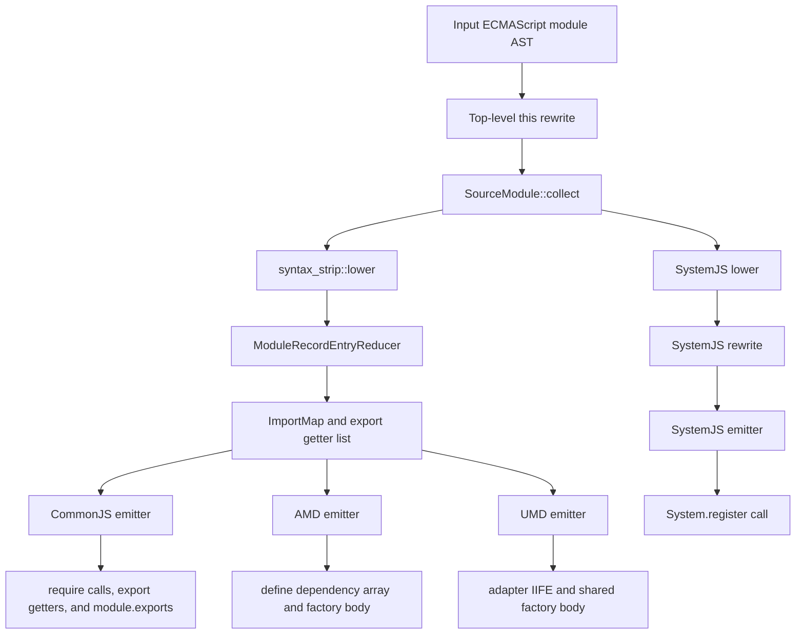
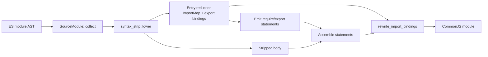

# Module Transforms

This crate lowers ECMAScript module syntax into several legacy module formats.
The CommonJS, AMD, and UMD passes share one source-module collection and
reduction model, then diverge at the format-specific import/export emit
boundary. The SystemJS pass also reuses source-module collection, but it lowers
the collected records into a SystemJS-specific IR instead of using the shared
CommonJS-like reducer.



SystemJS is documented separately below because its live-binding and execution
model is organized around `System.register`, dependency setters, and an
`execute` function.

## Shared Terminology

The shared collector in `src/module_record.rs` intentionally uses names close
to the ECMAScript module record vocabulary:

- `SourceModule::collect` walks source module declarations, records their
  module linkage information, and keeps ordered executable source items.
- `SourceModuleItem` keeps declarations that target lowerers still need to
  lower, including exported declarations, default exports, and external
  TypeScript `import = require(...)`.
- `RequestedModules` is grouped by `ModuleRequestRecord` and preserves source
  order with `IndexMap`.
- `ModuleRequestRecord` stores the module specifier and normalized import
  attributes for that request.
- `RequestedModule` stores the first useful source span, the collected
  `ModuleRecordEntry` set, and `ModuleRequestUsage`.
- `LocalExportEntries` stores local exports keyed by exported name.
- `ModuleRecordEntry` represents import entries, indirect export entries, and
  star exports.
- `syntax_strip::lower` converts `SourceModule` into `SyntaxStrippedModule` for
  the CommonJS, AMD, and UMD passes.
- `ModuleRecordEntryReducer` converts collected entries into emitter-facing
  structures: an `ImportMap` for rewritten local references and an
  `ExportObjectProperties` list for generated export getters.

`SourceModule` is a target-neutral collection model, not a full ECMAScript
linker. `ModuleRecordEntryReducer` converts its syntactic linkage facts for
CommonJS-like emitters and keeps unresolved binding access lazy through generated
property reads.

SystemJS preserves import attributes in its dependency metadata. CommonJS, AMD,
and UMD do not process import attributes because their output formats cannot
express them; those lowering paths assume attributed requests are not provided.

## Shared Front-End Flow

The CommonJS, AMD, and UMD transforms follow the same broad pipeline:

1. Replace top-level `this` with `undefined` unless
   `Config::allow_top_level_this` is enabled.
2. Run `SourceModule::collect`.
3. Run `syntax_strip::lower` to remove module syntax from the executable body.
4. Move initial directive statements into the output body.
5. Insert `"use strict"` when `Config::strict_mode` requires it and the module
   does not already contain one.
6. Emit an `__esModule` marker when the input had module syntax, import interop
   is enabled, and the module is not a TypeScript `export =` module.
7. Convert collected module entries into format-specific import statements,
   dependency parameters, export getters, and import-reference rewrites.
8. Append the stripped executable body.
9. Apply format-specific handling for `export =`, dynamic `import()`, and
   `import.meta` where supported by that transform.
10. Rewrite local import binding references using the generated `ImportMap`.

The strip step removes module declarations while preserving executable
declarations:

- `import ... from "mod"` is removed after its import entries are collected.
- `export const foo = 1` becomes `const foo = 1`, and `foo` is registered in
  `LocalExportEntries`.
- `export { foo as bar }` is removed and recorded as a local export entry.
- `export { foo as bar } from "mod"` is removed and recorded as an indirect
  export entry under the requested module.
- `export * from "mod"` is removed and recorded as `StarExport`.
- `export default function foo() {}` keeps the declaration and records
  `"default" -> foo`.
- `export default expr` becomes a generated `_default` binding and records
  `"default" -> _default`.
- A non-exported external TypeScript `import x = require("mod")` is kept as an
  ordered source item for the target lowerer. It models the CTS form of ES
  `import.sync`, so it does not participate in ES module linking or mark the
  source as an ES module.
- The exported form also registers `x` in `LocalExportEntries` and therefore
  participates in module linking.
- Type-only imports and exports do not create runtime module entries.

## Module Request Usage

`ModuleRequestUsage` summarizes which runtime shape a requested module needs:

- `NAMED` means generated code reads named properties from the module object.
- `DEFAULT` means generated code may need default interop.
- `NAMESPACE` is the combined named/default shape needed for namespace imports
  and namespace re-exports.
- `STAR_EXPORT` means generated code calls the `_export_star` helper.

When `importInterop` is `none`, namespace usage is removed before emit because
the transform must not inject interop helpers.

## Entry Reduction

`ModuleRecordEntryReducer` is the shared bridge from module-record-like entries
to CommonJS-like emit structures:

- Named imports add `local -> module.importName` entries to `ImportMap`.
- Default imports add `local -> module.default`, except Node default interop can
  map default-only imports directly to the module object.
- Namespace imports add `local -> module`.
- Indirect named/default exports add synthetic imported bindings to `ImportMap`
  and then add export getter entries.
- Indirect namespace exports add an export getter that returns the module object.
- Star exports are emitted by the caller with `_export_star(...)`.

Export getters are sorted by exported name before emit. A single export uses a
direct `Object.defineProperty` call, while multiple exports use the shared
`_export(exports, { ... })` helper shape.

## CommonJS Binding Flow

The CommonJS-like binding path can be summarized as:



## CommonJS Flow

The CommonJS pass lives in `src/common_js.rs` and produces direct `require(...)`
calls.

CommonJS lowers external TypeScript `import x = require("mod")` after
`syntax_strip::lower` keeps it in the executable body:

- Non-exported `import x = require("mod")` becomes
  `const x = require("mod")` or `var x = require("mod")`.
- Exported `export import x = require("mod")` becomes
  `exports.x = require("mod")` and adds `x -> exports.x` to the import map.

For each requested module, CommonJS:

1. Creates a stable private module identifier from the request string.
2. Reduces module entries into `ImportMap` and export bindings.
3. Builds `require("mod")` through the configured path resolver.
4. Wraps the require call in `_export_star(require("mod"), exports)` for star
   re-exports.
5. Applies interop helpers:
   - SWC default interop uses `_interop_require_default(...)`.
   - SWC namespace/default combined usage uses
     `_interop_require_wildcard(...)`.
   - Node namespace usage uses `_interop_require_wildcard(..., true)`.
6. Emits either a declaration for the module temporary, a lazy require wrapper,
   or a side-effect-only statement.

Before module request statements, CommonJS emits local and indirect export
getters unless the module uses `export =`. For `export = expr`, the pass appends
`module.exports = expr`.

When `exportInteropAnnotation` is enabled, CommonJS also emits
`cjs-module-lexer`-friendly dead-code annotations such as
`0 && (exports.foo = 0)` and star re-export annotations.

Dynamic `import()` is lowered to a `Promise.resolve(...).then(...)` shape that
calls `require(...)`. Literal dynamic import paths are resolved before emit.
`import.meta` is lowered to CommonJS equivalents such as `__filename`,
`__dirname`, `require.resolve`, or `require.main == module` unless
`preserveImportMeta` is enabled.

## AMD Flow

The AMD pass lives in `src/amd.rs` and emits one `define(...)` call.

Before wrapping, AMD builds a factory body using the shared front-end flow. Each
requested module contributes:

1. A dependency entry in `dep_list`.
2. A factory parameter identifier.
3. Import-map and export-binding entries through `ModuleRecordEntryReducer`.
4. Optional post-parameter interop assignment inside the factory body.

External TypeScript `import x = require("mod")` also contributes a dependency
entry and factory parameter. Exported forms assign that parameter to
`exports.x`.

The final wrapper dependency array always starts with `"require"` and a matching
`require` factory parameter. The pass adds `"exports"` only when generated code
needs the exports object, and `"module"` only when generated `import.meta`
lowering needs it. Requested modules are appended after those special AMD
dependencies.

The call shape is:

```javascript
define([deps...], function (params...) {
    // generated body
});
```

If `Config::module_id` is present, it is emitted as the first `define` argument.
If it is absent, the pass can read a TypeScript-style
`/// <amd-module name="..."/>` leading line comment and use that name.

For `export = expr`, AMD appends `return expr` from the factory body instead of
using an exports object.

Dynamic `import()` is lowered to:

```javascript
new Promise(function (resolve, reject) {
    require([arg], function (m) {
        resolve(interopedModule);
    }, reject);
});
```

`import.meta` is lowered with AMD primitives where possible, for example
`module.uri`, `require.toUrl(...)`, and `module.id == "main"`.

## UMD Flow

The UMD pass lives in `src/umd.rs` and emits an adapter IIFE plus a factory.
The factory body is produced with the same collection and reduction flow as AMD.
Requested modules are stored in `dep_list` and become factory parameters.

External TypeScript `import x = require("mod")` also becomes a factory
parameter. Exported forms assign that parameter to `exports.x`.

The wrapper chooses among CommonJS, AMD, and global execution:

```javascript
(function (global, factory) {
    if (typeof module === "object" && typeof module.exports === "object") {
        factory(exports, require("mod"));
    } else if (typeof define === "function" && define.amd) {
        define(["exports", "mod"], factory);
    } else if (global = typeof globalThis !== "undefined" ? globalThis : global || self) {
        factory((global.lib = {}), global.mod);
    }
})(this, function (exports, mod) {
    // generated body
});
```

When `SourceModule` records a TypeScript `export =` assignment, UMD does not
create an exports object parameter. The generated factory returns the assigned
expression, and the CommonJS branch assigns that factory result to
`module.exports`. The browser fallback assigns the same result to the inferred
global export name:

```javascript
module.exports = factory(require("mod"));
define(["mod"], factory);
global.lib = factory(global.mod);
```

Some TypeScript/CommonJS syntax paths are already represented as executable
`module.exports = ...` statements in the factory body by the time the UMD wrapper
is emitted; those paths keep the normal wrapper call shape.

UMD determines the global export name from the configured `globals` and module
name settings. It resolves dependency request strings before emitting the CJS
`require(...)`, AMD dependency string, and browser global property access.

Unlike the CommonJS and AMD passes, the current UMD pass does not rewrite
dynamic `import()` or `import.meta` itself in this module-transform stage.

## SystemJS Flow

The SystemJS pass lives in `src/system_js.rs` with private implementation
modules in `src/system_js/`. Its public entry point is
`system_js(resolver, unresolved_mark, config)`, and its public `Config` type is
the shared `util::Config`.


SystemJS shares only the collection stage with the CommonJS-like passes. It
lowers `RequestedModules`, `LocalExportEntries`, ordered source items, and
TypeScript `export =` assignments into a private SystemJS IR. It does not use
`syntax_strip::lower`, `ModuleRecordEntryReducer`, `ImportMap`, export getter
emission, or helper injection.

`src/system_js.rs` owns the public pass, directive handling, strict mode,
top-level `this` rewrite, and top-level-await detection. The private
`src/system_js/` modules then own the format-specific stages:

- `lower.rs` builds `SystemModule`: dependency slots, wrapper-scope bindings,
  export announcements, and execute-time statements.
- `rewrite.rs` is the scoped visitor boundary for `import.meta`, dynamic
  `import()`, `__moduleName`, and live-binding updates.
- `emit.rs` is the only layer that creates the final `System.register(...)`
  call.

Lowering keeps SystemJS timing explicit. ECMAScript module requests are merged
by `ModuleRequestRecord` in first-observed order, and each dependency slot owns
the setter operations needed for imports and re-exports. Dependency requests
from external TypeScript `import = require(...)` stay outside `RequestedModules`
and lower to independent dependency slots. Top-level function declarations stay
in wrapper scope, while variable and class initializers run from `execute`.
Import attributes stay attached to dependency slots and become the optional
metadata argument to `System.register`.

Local exports are announced before the returned `{ setters, execute }` object:
function exports, including anonymous default functions, use their function
values, and other exports start as `void 0`. Later writes to exported locals
call `_export`; exported destructuring and loop heads use setter patterns so
local bindings and exported values stay in sync.

After ordered source items are lowered, TypeScript `export = expr` is appended
to `execute` as a batch export update:

```javascript
_export(expr);
```

## Helper Injection

`src/import_analysis.rs` runs before module lowering to enable only the helpers
required by the module syntax in the source:

- `_export_star` is enabled when any module request has `STAR_EXPORT`.
- `_interop_require_default` is enabled for SWC default-only interop.
- `_interop_require_wildcard` is enabled for namespace usage and, when dynamic
  import is not ignored, for possible dynamic-import interop.

The emitters assume these helpers are available when they generate the
corresponding helper calls.

## Important Boundaries

- `module_record.rs` owns target-neutral source module collection and the
  CommonJS-like `ModuleRecordEntryReducer`.
- `syntax_strip.rs` owns the CommonJS-like module syntax stripping step.
- `common_js.rs`, `amd.rs`, and `umd.rs` own target lowering, dependency
  construction, interop application, and special runtime rewrites for their
  format.
- `amd/emit.rs` and `umd/emit.rs` own wrapper construction for those formats.
- `system_js.rs` owns the SystemJS facade, while `src/system_js/` owns its
  private IR, lowering, rewrite traversal, and `System.register` emission.
- `module_ref_rewriter.rs` owns replacing imported local binding references with
  the generated property access.
- `util.rs` owns shared helper-building code such as `define_es_module`,
  `_export(...)` emission, export sorting, and property-name construction.

Keeping these boundaries intact makes it easier to adjust interop behavior or
add module-record fields without coupling the collector to a specific output
format.
